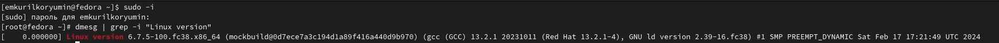

---
## Front matter
lang: ru-RU
title: Лабораторная работа №1
subtitle: Операционные системы
author:
  - Курилко-Рюмин Е.М
institute:
  - Российский университет дружбы народов, Москва, Россия
date: 01 марта 2023

## i18n babel
babel-lang: russian
babel-otherlangs: english

## Formatting pdf
toc: false
toc-title: Содержание
slide_level: 2
aspectratio: 169
section-titles: true
theme: metropolis
header-includes:
 - \metroset{progressbar=frametitle,sectionpage=progressbar,numbering=fraction}
 - '\makeatletter'
 - '\beamer@ignorenonframefalse'
 - '\makeatother'
 
## font
mainfont: PT Serif
romanfont: PT Serif
sansfont: PT Sans
monofont: PT Mono
mainfontoptions: Ligatures=TeX
romanfontoptions: Ligatures=TeX
sansfontoptions: Ligatures=TeX,Scale=MatchLowercase
monofontoptions: Scale=MatchLowercase,Scale=0.9
 
---

## Цель работы

Целью данной лабораторной работы является приобретение практических навыков установки операционной системы на виртуальную машину, настройки минимально необходимых для дальнейшей работы сервисов.

## Задание

 1. Первичное ознакомление с заданием.
 2. Создание виртуальной машины.
 3. Установка операционной системы.
 4. Работа с операционной системой после установки.
 5. Установка программного обеспечения для создания документации.
 6. Выполнение доп.задания

## Выполнение лабораторной работы

Virtualbox я устанавливал и настраивал при выполнении лабораторной работы в курсе "Архитектура компьютера ", поэтому сразу открываю окно приложения (рис.1).

{#fig:001 width=70%}

## Выполнение лабораторной работы

Нажимая "создать", создаю новую виртуальную машину, указываю ее имя, путь к папке машины по умолчанию меня устраивает, выбираю тип ОС и версию (рис.2).

{#fig:002 width=70%}

## Выполнение лабораторной работы 

Указываю объем основной памяти виртуальной машины размером 4096МБ (рис.3).

{#fig:003 width=70%}

## Выполнение лабораторной работы

Задаю размер диска - 80 ГБ, оставляю расположение жесткого диска по умолчанию, т. к. работаю на собственной технике и значение по умолчанию меня устраивает (рис.4).

{#fig:004 width=70%}

## Установка операционной системы

Данный этап лабораторной работы я пропускаю по причине уже установленной операционной системы из предыдущего курса "Архитектура компьютера"

## Работа с операционной системой после установки

Вхожу в ОС под заданной мной при установке учетной записью, запускаю терминал и переключаюсь на роль супер-пользователя, обновляю все пакеты (рис.5).

{#fig:005 width=70%}

## Работа с операционной системой после установки

Устанавливаю программы для удобства работы в консоли: tmux для открытия нескольких вкладок в одном терминале (рис.6).

{#fig:006 width=70%}

## Работа с операционной системой после установки

Устанавливаю программы для автоматического обновления (рис.7).

{#fig:007 width=70%}

## Работа с операционной системой после установки

Перемещаюсь в директорию /etc/selinux, открываю mс, ищу нужный файл (рис.8).

{#fig:008 width=70%}

## Работа с операционной системой после установки

Изменяю открытый файл: SELINUX=enforcing меняю на значение SELINUX=permissive (рис.9)

{#fig:009 width=70%}

## Работа с операционной системой после установки

Перезагружаю виртуальную машину (рис.10).

{#fig:010 width=70%}

## Работа с операционной системой после установки

Снова вхожу в ОС, снова запускаю терминал, запускаю терминальный мультиплексор (рис.11).

{#fig:011 width=70%}

## Работа с операционной системой после установки

Переключаюсь на роль супер-пользователя (рис.12).

{#fig:012 width=70%}

## Работа с операционной системой после установки

Устанавливаю пакет DevelopmentTools (рис.13).

{#fig:013 width=70%}

## Работа с операционной системой после установки

Устанавливаю пакет dkms (рис.14).

{#fig:014 width=70%}

## Работа с операционной системой после установки

В меню виртуальной машины подключаю образ диска гостевой ОС и примонтирую диск с помощью утилиты mount, устанавливаю драйвера (рис.15).

{#fig:015 width=70%}

## Работа с операционной системой после установки

Перехожу в директорию /tc/X11/xorg.conf.d, открываю mc для удобства, открываю файл 00-keyboard.conf (рис.16).

{#fig:016 width=70%}

## Работа с операционной системой после установки

Редактирую конфигурационный файл (рис.17).

{#fig:017 width=70%}

## Работа с операционной системой после установки

Перезагружаю виртуальную машину (рис.18).

{#fig:018 width=70%}

## Установка программного обеспечения для создания документации

Запускаю терминал. Запускаю терминальный мультиплексор tmux, переключаюсь на роль супер-пользователя. Устанавливаю pandoc с помощью утилиты dnf (рис.19).

{#fig:019 width=70%}

## Установка программного обеспечения для создания документации

Устанавливаю дистрибутив texlive (рис.20).

{#fig:020 width=70%}

## Доп.задания

Ввожу в терминал команду dmesg,чтобы провести анализ моей системы (рис.21)

{#fig:021 width=70%}

## Доп.задания

С помощью команды "dmesg | grep -i <то что ищем>" нахожу информацию которою требует от меня задание (рис.22)

{#fig:022 width=70%}

## Доп.задания

В задании нужно узнать частоту процессора,однако если вводить в поиск "Detected Mhz processor",то тогда программа ничего не выводит.Поэтому в запросе оставляю только ключевое слово "processor" и это работает и мы полчаем результат (рис.23)

{#fig:023 width=70%}

## Доп.задания

Далее нахожу модель процессора (рис.24)

{#fig:024 width=70%}

## Доп.задания

Объем доступной оперативной памяти ищу аналогично поиску частоты процессора, т. к. возникла та же проблема, что и с частатой процессора (рис.25).

{#fig:025 width=70%}

## Доп.задания

Нахожу тип обнаруженного гипервизора (рис. 26).

{#fig:026 width=70%}

## Выводы

В ходе выполнения данной лабораторной работы я приобрел практические навыки установки операционной системы на виртуальную машину.

