---
## Front matter
title: "лабораторная работа № 2"
subtitle: "Операционные системы"
author: "Курилко-Рюмин Евгений Михайлович"

## Generic otions
lang: ru-RU
toc-title: "Содержание"

## Bibliography
bibliography: bib/cite.bib
csl: pandoc/csl/gost-r-7-0-5-2008-numeric.csl

## Pdf output format
toc: true # Table of contents
toc-depth: 2
lof: true # List of figures
lot: true # List of tables
fontsize: 12pt
linestretch: 1.5
papersize: a4
documentclass: scrreprt
## I18n polyglossia
polyglossia-lang:
  name: russian
  options:
	- spelling=modern
	- babelshorthands=true
polyglossia-otherlangs:
  name: english
## I18n babel
babel-lang: russian
babel-otherlangs: english
## Fonts
mainfont: PT Serif
romanfont: PT Serif
sansfont: PT Sans
monofont: PT Mono
mainfontoptions: Ligatures=TeX
romanfontoptions: Ligatures=TeX
sansfontoptions: Ligatures=TeX,Scale=MatchLowercase
monofontoptions: Scale=MatchLowercase,Scale=0.9
## Biblatex
biblatex: true
biblio-style: "gost-numeric"
biblatexoptions:
  - parentracker=true
  - backend=biber
  - hyperref=auto
  - language=auto
  - autolang=other*
  - citestyle=gost-numeric
## Pandoc-crossref LaTeX customization
figureTitle: "Рис."
tableTitle: "Таблица"
listingTitle: "Листинг"
lofTitle: "Список иллюстраций"
lotTitle: "Список таблиц"
lolTitle: "Листинги"
## Misc options
indent: true
header-includes:
  - \usepackage{indentfirst}
  - \usepackage{float} # keep figures where there are in the text
  - \floatplacement{figure}{H} # keep figures where there are in the text
---
# Цель работы

Цель лабораторной работы заключается в изучение применения средств контроля версий,а также освоение умения по работе с git.

# Задание

1. Создание базовой конфигурацию для работы с git
2. Создание SSH ключ 
3. Создание GPG ключ 
4. Настройка подписи Git
5. Регистрирование на GitHub
6. Создание локального каталога для выполнения заданий по предмету.

# Теоретическое введение

Системы контроля версий (Version Control System, VCS) применяются при работе нескольких человек над одним проектом. Обычно основное дерево проекта хранится в локальном или удалённом репозитории, к которому настроен доступ для участников проекта. При внесении изменений в содержание проекта система контроля версий позволяет их фиксировать, совмещать изменения, произведённые разными участниками проекта, производить откат к любой более ранней версии проекта, если это требуется.

В классических системах контроля версий используется централизованная модель, предполагающая наличие единого репозитория для хранения файлов. Выполнение большинства функций по управлению версиями осуществляется специальным сервером. Участник проекта (пользователь) перед началом работы посредством определённых команд получает нужную ему версию файлов. После внесения изменений, пользователь размещает новую версию в хранилище. При этом предыдущие версии не удаляются из центрального хранилища и к ним можно вернуться в любой момент. Сервер может сохранять не полную версию изменённых файлов, а производить так называемую дельта-компрессию — сохранять только изменения между последовательными версиями, что позволяет уменьшить объём хранимых данных.

Системы контроля версий поддерживают возможность отслеживания и разрешения конфликтов, которые могут возникнуть при работе нескольких человек над одним файлом. Можно объединить (слить) изменения, сделанные разными участниками (автоматически или вручную), вручную выбрать нужную версию, отменить изменения вовсе или заблокировать файлы для изменения. В зависимости от настроек блокировка не позволяет другим пользователям получить рабочую копию или препятствует изменению рабочей копии файла средствами файловой системы ОС, обеспечивая таким образом, привилегированный доступ только одному пользователю, работающему с файлом.

Системы контроля версий также могут обеспечивать дополнительные, более гибкие функциональные возможности. Например, они могут поддерживать работу с несколькими версиями одного файла, сохраняя общую историю изменений до точки ветвления версий и собственные истории изменений каждой ветви. Кроме того, обычно доступна информация о том, кто из участников, когда и какие изменения вносил. Обычно такого рода информация хранится в журнале изменений, доступ к которому можно ограничить.

В отличие от классических, в распределённых системах контроля версий центральный репозиторий не является обязательным.

Среди классических VCS наиболее известны CVS, Subversion, а среди распределённых — Git, Bazaar, Mercurial. Принципы их работы схожи, отличаются они в основном синтаксисом используемых в работе команд.

# Выполнение лабораторной работы

## Установка программного обеспечения

Устанавливаю необходимое программное обеспечение git и gh через терминал с помощью команд: dnf install git и dnf install gh (рис. @fig:001).

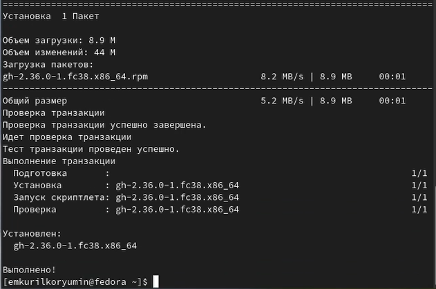{#fig:001 width=70%}

## Базовая настройка git

Задаю в качестве имени владельца репозитория и его email свое имя,фамилию и почту (рис. @fig:002)

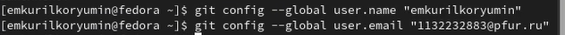{#fig:002 width=70%}

Настраиваю utf-8 в выводе сообщений git для корректного отображения (рис. @fig:003)

{#fig:003 width=70%}

Задаю имя для начальной ветки "master" (рис. @fig:004)

{#fig:004 width=70%}

Далее задаю параметры для autocrlf и safecrlf для корректного отображения конца строки (рис. @fig:005)

{#fig:005 width=70%}

## Создание SSH ключа

Создаю SSH ключ размером 4096 бит по алгоритму RSA (рис. @fig:006)

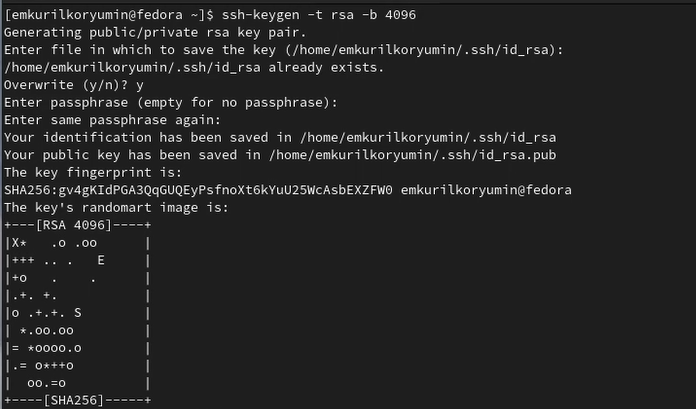{#fig:006 width=70%}

Создаю ключ ssh по алгоритму ed25519 (рис. @fig:007).

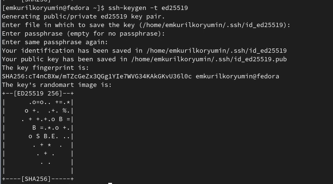{#fig:007 width=70%}

## Создание ключа GPG

Генерирую ключ GPG, затем выбираю тип ключа RSA и RSA, задаю максиммальную длину ключа: 4096, оставляю неограниченный срок действия ключа. Далее отвечаю на вопросы программы о личной информации (рис. @fig:008).

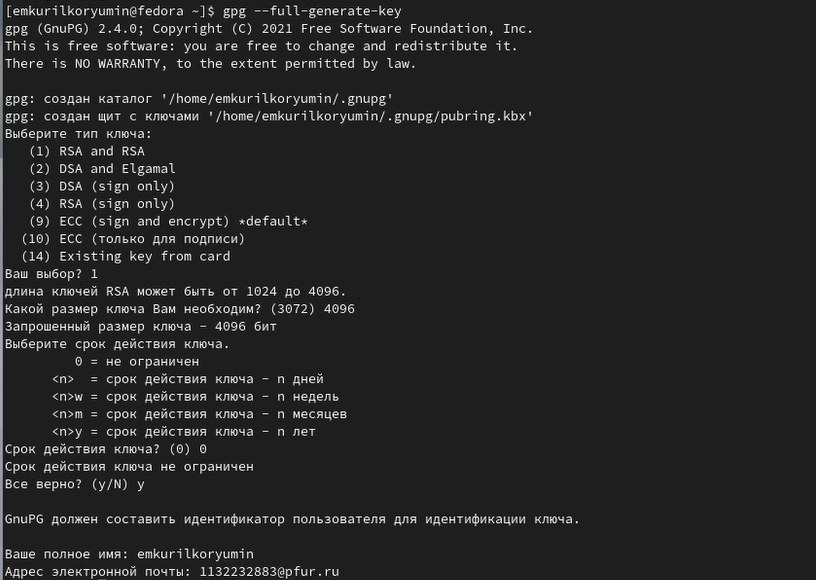{#fig:008 width=70%}

Ввожу фразу-пароль для защиты нового ключа (рис. @fig:009).

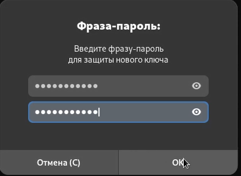{#fig:009 width=70%}

##Создание учётной записи на Github

Так как у меня уже был создан аккаунт на Github,то основные данные аккаунта и его настройка уже была проведена мной,поэтому просто захожу в свой аккаунт (рис. @fig:010).

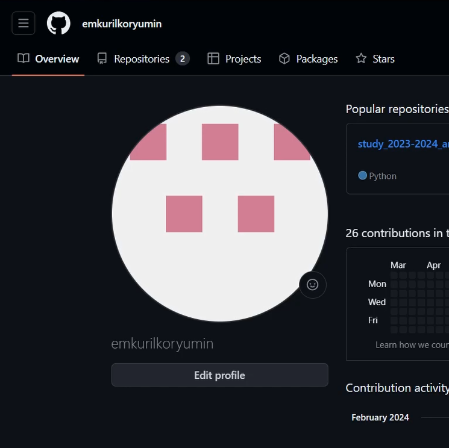{#fig:010 width=70%}

## Добавление ключа GPG в Github

Вывожу список созданных ключей в терминал, ищу последовательность байтов для идентификации более длинного, по сравнению с самим отпечатком ключа,
копирую его в буфер обмена (рис. @fig:011).

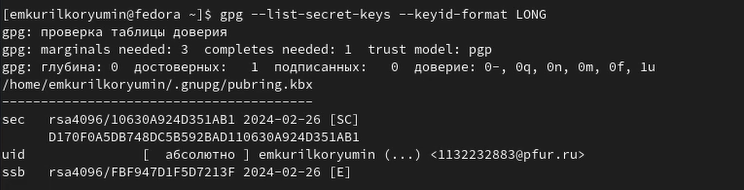{#fig:011 width=70%}

Ввожу в терминале команду, с помощью которой копирую сам ключ GPG в буфер обмена, за это отвечает утилита xclip (рис. @fig:012).

{#fig:012 width=70%}

Открываю настройки GirHub, ищу среди них добавление GPG ключа (рис. @fig:013).

{#fig:013 width=70%}

Нажимаю на "New GPG key" и вставляю в поле ключ из буфера обмена (рис. @fig:014).

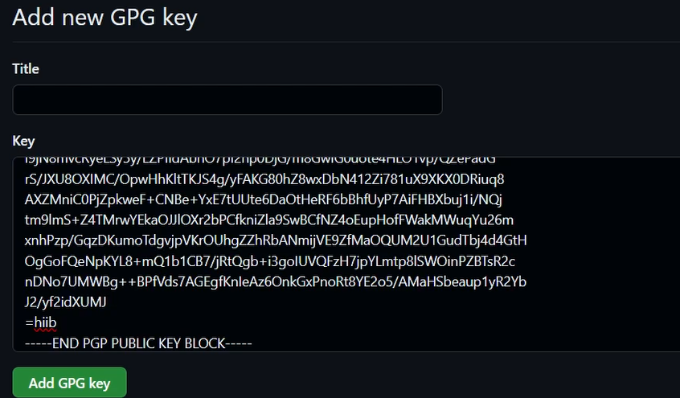{#fig:014 width=70%}

Ключ GPG добавлен на GitHub (рис. @fig:015).

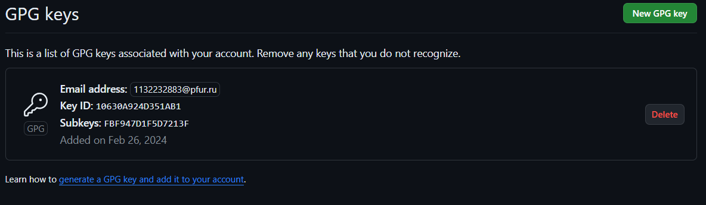{#fig:015 width=70%}

##Настройка автоматических подписей коммитов git

Настраиваем автоматическую подпись коммитов git используя введеный ранее email,указываем git который буду использовать при создании подписей коммитов (рис. @fig:016).

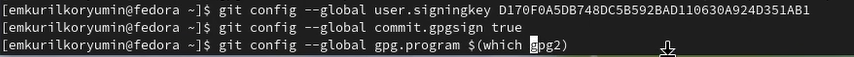{#fig:016 width=70%}

## Настройка gh

Начинаю авторизацию в gh, отвечаю на наводящие вопросы от утилиты, в конце выбираю авторизоваться через браузер (рис. @fig:017).

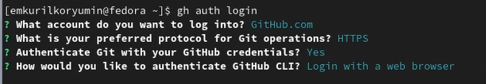{#fig:017 width=70%}

Завершаю авторизацию на сайте (рис. @fig:018).

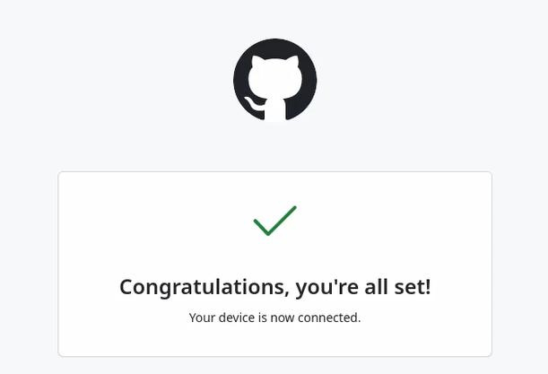{#fig:018 width=70%}

Вижу сообщение о завершении авторизации,в докозательство выводится мое имя emkurilkorymin (рис. @fig:019).

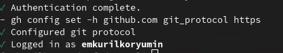{#fig:019 width=70%}

##Сознание репозитория курса на основе шаблона

Создаю директорию с помощью утилиты mkdir и флага -p, который позволяет установить каталоги на всем указанном пути. После этого с помощью утилиты cd перехожу в  созданную директорию.Далее в терминале ввожу команду gh repo create study_2023-2024_os-intro --template yamadharma/course-directory-student-trmplate --public, чтобы создать репозиторий на основе шаблона репозитория. После этого клонирую репозиторий к себе в 
директорию (рис. @fig:020).

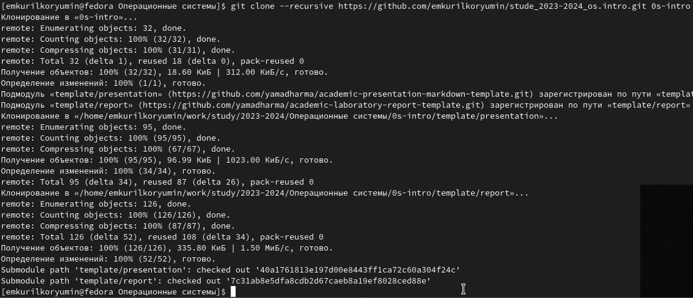{#fig:020 width=70%}

Дальше перехожу в каталог курса применя утилиту cd (рис. @fig:021).

{#fig:021 width=70%}

Удаляем лишние файлы с помощью утилиты rm,затем создаю каталог используя makefile (рис. @fig:022).

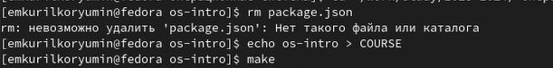{#fig:022 width=70%}

С помощью команд git add и git commit,добавляю новые файлы и комментирую их для отправки на сервер (рис. @fig:023).

{#fig:023 width=70%}

Отправляю файлы на сервер (рис. @fig:024).

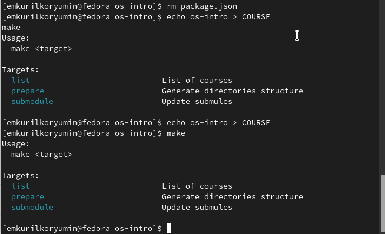{#fig:024 width=70%}

# Выводы

В ходе выполнения лабораторной работы я научился применять средства контроля версий,а также получил знания по работе с git.

# Ответы на контрольные вопросы.

1. Системы контроля версий (VCS) - программное обеспечение для облегчения работы с изменяющейся информацией. 
Они позволяют хранить несколько версий изменяющейся информации, 
одного и того же документа, может предоставить доступ к более ранним версиям документа. 
Используется для работы нескольких человек над проектом, позволяет посмотреть, кто и 
когда внес какое-либо изменение и т. д. VCS ррименяются для: Хранения понлой истории изменений, 
сохранения причин всех изменений, поиска причин изменений и совершивших изменение, совместной работы над проектами.

2. Хранилище -- репозиторий, хранилище версий, в нем хранятся все документы, включая историю их изменения и прочей служебной информацией. 
commit -- отслеживание изменений, сохраняет разницу в изменениях.
История -- хранит все изменения в проекте и позволяет при необходимости вернуться/обратиться к нужным данным.
Рабочая копия -- копия проекта, основанная на версии из хранилища, чаще всего последней версии.

3. Централизованные VCS (например: CVS, TFS, AccuRev) -- одно основное хранилище всего проекта. Каждый пользователь копирует себе
необходимые ему файлы из этого репозитория, изменяет, затем добавляет изменения обратно в хранилище. Децентрализованные
VCS (например: Git, Bazaar) -- у каждого пользователя свой вариант репозитория (возможно несколько вариантов), есть возможность добавлять
и забирать изменения из любого репозитория. В отличие от классических, в распределенных (децентралиованных)
системах контроля версий центральный репозиторий не является обязательным.

4. Сначала создается и подключается удаленный репозиторий, затем по мере изменения проекта эти изменения отправляются на сервер.

5. Участник проекта перед началом работы получает нужную ему версию проекта в хранилище, с помощью определенных команд, после внесения изменений пользователь размещает новую версию в хранилище. При этом предыдущие версии не удаляются. К ним можно вернуться в любой момент.

6. Хранение информации о всех изменениях в вашем коде, обеспечение удобства командной работы над кодом.

7. Создание основного дерева репозитория: git init

Получение обновлений (изменений) текущего дерева из центрального репозитория: git pull

Отправка всех произведённых изменений локального дерева в центральный репозиторий: git push

Просмотр списка изменённых файлов в текущей директории: git status

Просмотр текущих изменений: git diff

Сохранение текущих изменений: добавить все изменённые и/или созданные файлы и/или каталоги: git add .

добавить конкретные изменённые и/или созданные файлы и/или каталоги: git add имена_файлов

удалить файл и/или каталог из индекса репозитория (при этом файл и/или каталог остаётся в локальной директории): git rm имена_файлов

Сохранение добавленных изменений:

сохранить все добавленные изменения и все изменённые файлы: git commit -am 'Описание коммита'

сохранить добавленные изменения с внесением комментария через встроенный редактор: git commit

создание новой ветки, базирующейся на текущей: git checkout -b имя_ветки

переключение на некоторую ветку: git checkout имя_ветки (при переключении на ветку, которой ещё нет в локальном репозитории, она будет создана и связана с удалённой)

отправка изменений конкретной ветки в центральный репозиторий: git push origin имя_ветки

слияние ветки с текущим деревом: git merge --no-ff имя_ветки

Удаление ветки:

удаление локальной уже слитой с основным деревом ветки: git branch -d имя_ветки

принудительное удаление локальной ветки: git branch -D имя_ветки

удаление ветки с центрального репозитория: git push origin :имя_ветки

8. git push -all отправляем из локального репозитория все сохраненные изменения в центральный репозиторий, предварительно создав локальный репозиторий и сделав предварительную конфигурацию.

9. Ветвление - один из параллельных участков в одном хранилище, исходящих из одной версии, обычно есть главная ветка. 
Между ветками, т. е. их концами возможно их слияние. Используются для разработки новых функций.

10. Во время работы над проектом могут создаваться файлы, которые не следуют добавлять в репозиторий. Например, временные файлы.
Можно прописать шаблоны игнорируемых при добавлении в репозиторий типов файлов в файл .gitignore с помощью сервисов.

::: {#refs}
:::
