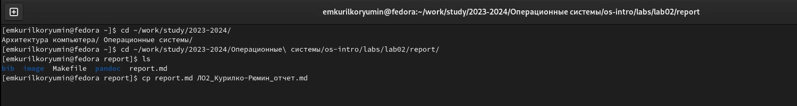
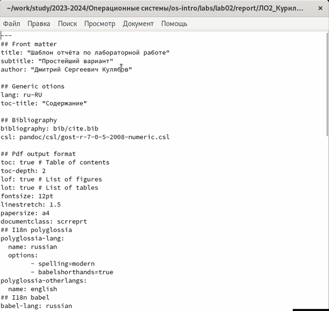
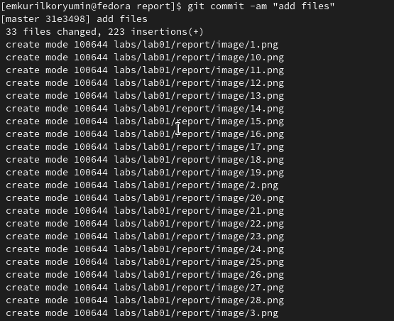

---
## Front matter
lang: ru-RU
title: Лабораторная работа №3
subtitle: Операционные системы
author:
  - Курилко-Рюмин Е.М
institute:
  - Российский университет дружбы народов, Москва, Россия
date: 01  марта 2023

## i18n babel
babel-lang: russian
babel-otherlangs: english

## Formatting pdf
toc: false
toc-title: Содержание
slide_level: 2
aspectratio: 169
section-titles: true
theme: metropolis
header-includes:
 - \metroset{progressbar=frametitle,sectionpage=progressbar,numbering=fraction}
 - '\makeatletter'
 - '\beamer@ignorenonframefalse'
 - '\makeatother'
 
## font
mainfont: PT Serif
romanfont: PT Serif
sansfont: PT Sans
monofont: PT Mono
mainfontoptions: Ligatures=TeX
romanfontoptions: Ligatures=TeX
sansfontoptions: Ligatures=TeX,Scale=MatchLowercase
monofontoptions: Scale=MatchLowercase,Scale=0.9

---

## Цели и задачи

- Научиться оформлять отчёты с помощью легковесного языка разметки Markdown.
- Сделать отчёт по предыдущей лабораторной работе в формате Markdown.

## Теоретическое введение

Markdown-является облегчённым языком разметки,созданный с целью обозначения форматирования в простом тексте,с максимальным сохранением его читаемости для людей,а также достаточно пригодным для машинного преобразования в языки для продвинутых публикаций.

## Выполнение лабораторной работы

Создаю копию шаблона, в которой буду работать (рис.1).

## Выполнение лабораторной работы

- открываю созданный файл (рис.2).
- редактирую его, используя язык рамзетки Markdown

## Выполнение лабораторной работы

Выполнил компиляцию отчета из формата md в форматы docx и pdf (рис.4).

## Выводы

При выполнении данной лабораторной работы я научился оформлять отчеты с помощью  языка разметки Markdown.

# Спасибо за внимание

