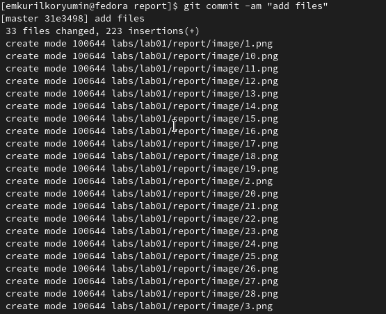

---
## Front matter
title: "Лабораторная работа№3"
subtitle: "Операционные системы"
author: "Курилко-Рюмин Евгений Михайлович"

## Generic otions
lang: ru-RU
toc-title: "Содержание"

## Bibliography
bibliography: bib/cite.bib
csl: pandoc/csl/gost-r-7-0-5-2008-numeric.csl

## Pdf output format
toc: true # Table of contents
toc-depth: 2
lof: true # List of figures
lot: true # List of tables
fontsize: 12pt
linestretch: 1.5
papersize: a4
documentclass: scrreprt
## I18n polyglossia
polyglossia-lang:
  name: russian
  options:
	- spelling=modern
	- babelshorthands=true
polyglossia-otherlangs:
  name: english
## I18n babel
babel-lang: russian
babel-otherlangs: english
## Fonts
mainfont: PT Serif
romanfont: PT Serif
sansfont: PT Sans
monofont: PT Mono
mainfontoptions: Ligatures=TeX
romanfontoptions: Ligatures=TeX
sansfontoptions: Ligatures=TeX,Scale=MatchLowercase
monofontoptions: Scale=MatchLowercase,Scale=0.9
## Biblatex
biblatex: true
biblio-style: "gost-numeric"
biblatexoptions:
  - parentracker=true
  - backend=biber
  - hyperref=auto
  - language=auto
  - autolang=other*
  - citestyle=gost-numeric
## Pandoc-crossref LaTeX customization
figureTitle: "Рис."
tableTitle: "Таблица"
listingTitle: "Листинг"
lofTitle: "Список иллюстраций"
lotTitle: "Список таблиц"
lolTitle: "Листинги"
## Misc options
indent: true
header-includes:
  - \usepackage{indentfirst}
  - \usepackage{float} # keep figures where there are in the text
  - \floatplacement{figure}{H} # keep figures where there are in the text
---

# Цель работы

Цель данной лабораторной работы - научиться оформлять отчёты с помощью легковесного языка разметки Markdown.

# Задание

1.Сделайте отчёт по предыдущей лабораторной работе в формате Markdown
2.В качестве отчёта просьба предоставить отчёты в 3 форматах: pdf, docx и md (в архиве,поскольку он должен содержать скриншоты, Makefile и т.д.)

# Теоретическое введение

Markdown-является облегчённым языком разметки,созданный с целью обозначения форматирования в простом тексте,с максимальным сохранением его читаемости для людей,а также достаточно пригодным для машинного преобразования в языки для продвинутых публикаций.

# Выполнение лабораторной работы

Перехожу в каталог с шаблоном для создания отчета по лабораторной работе, используя утилиту cd (рис.1).

{#fig:001 width=70%}

Создаю копию шаблона,используя для этого утилиту cp и начинаю работать в нем  (рис.2).

{#fig:002 width=70%}

Открываю копию созданного файла с помощью редактора Mousepad (рис.3).

{#fig:003 width=70%} 

После изменений шаблона под свои нужды в соответствии с языком разметки Markdown,я компилирую из формата md в привычные всем форматы docx и pdf (рис.4).

{#fig:004 width=70%} 

Отправляю созданные отчеты в репозиторий (рис.5).

{#fig:005 width=70%} 

# Выводы

При выполнении данной лабораторной работы я приобрёл практический опыт по оформлению отчетов с помощью легковесного языка разметки Markdown.

# Список литературы{.unnumbered}

[Архитектура компьютеров и ОС/Электронный ресурс](https://esystem.rudn.ru/pluginfile.php/2288079/mod_resource/content/3/003-lab_markdown.pdf)
  

