---
## Front matter
lang: ru-RU
title: Лабораторная работа №6
subtitle: Операционные системы
author:
  - Курилко-Рюмин Е.М
institute:
  - Российский университет дружбы народов, Москва, Россия
date: 15  марта 2023

## i18n babel
babel-lang: russian
babel-otherlangs: english

## Formatting pdf
toc: false
toc-title: Содержание
slide_level: 2
aspectratio: 169
section-titles: true
theme: metropolis
header-includes:
 - \metroset{progressbar=frametitle,sectionpage=progressbar,numbering=fraction}
 - '\makeatletter'
 - '\beamer@ignorenonframefalse'
 - '\makeatother'
 
## font
mainfont: PT Serif
romanfont: PT Serif
sansfont: PT Sans
monofont: PT Mono
mainfontoptions: Ligatures=TeX
romanfontoptions: Ligatures=TeX
sansfontoptions: Ligatures=TeX,Scale=MatchLowercase
monofontoptions: Scale=MatchLowercase,Scale=0.9

---

# Цели и задачи работы

## Цель лабораторной работы

Приобретение практических навыков взаимодействия пользователя с системой посредством командной строки.

## Задачи лабораторной работы

1 Определить имя и путь домашнего каталога

2 Изучить команду ls.

3 Выполнить действия с каталогами.

4 Получить дополнительные сведения при помощи справки по командам.

5 Изучить команду history.

# Процесс выполнения лабораторной работы

## Имя и путь к домашнему каталогу 

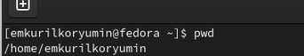{ #fig:001 width=70% height=70% }

## Опции команды ls

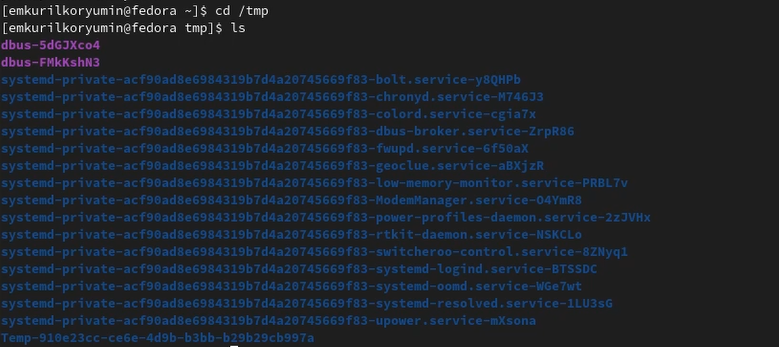{ #fig:002 width=70% height=70% }

## Опции команды ls

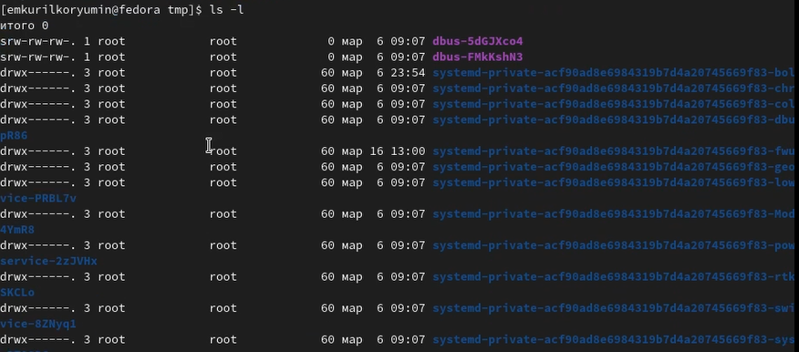{ #fig:003 width=70% height=70% }

## Каталог /var/spool

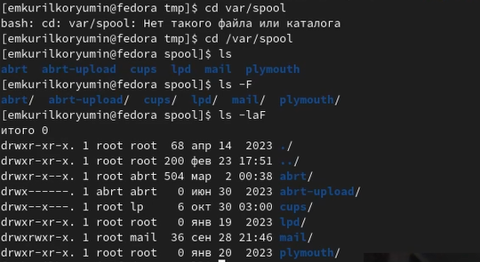{ #fig:004 width=70% height=70% }

## Домашний каталог

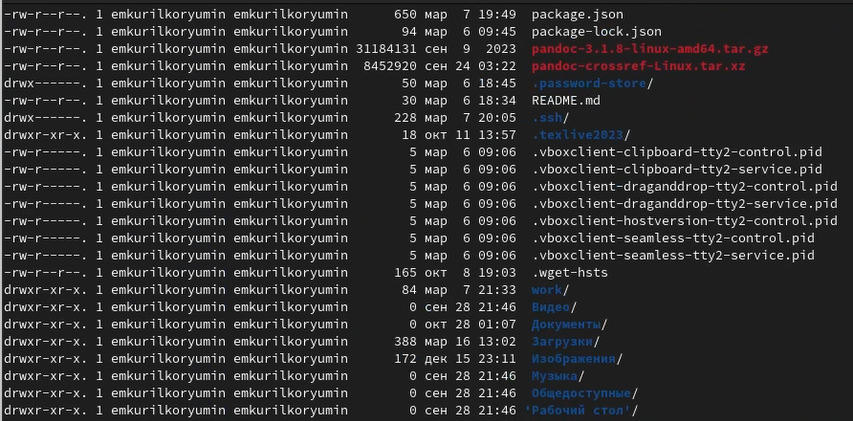{ #fig:005 width=70% height=70% }

## Работа с каталогами

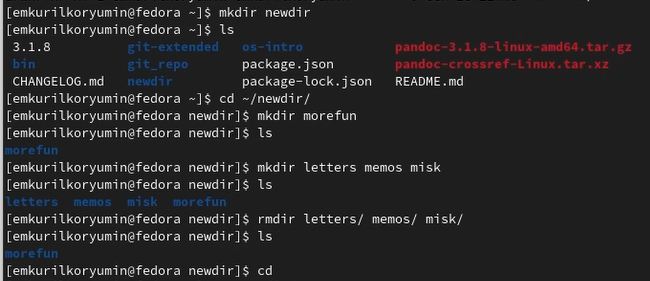{ #fig:006 width=70% height=70% }

## Опции команды ls

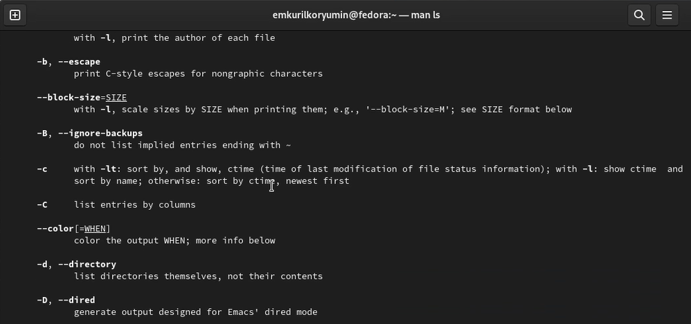{ #fig:007 width=70% height=70% }

## Справка по командам

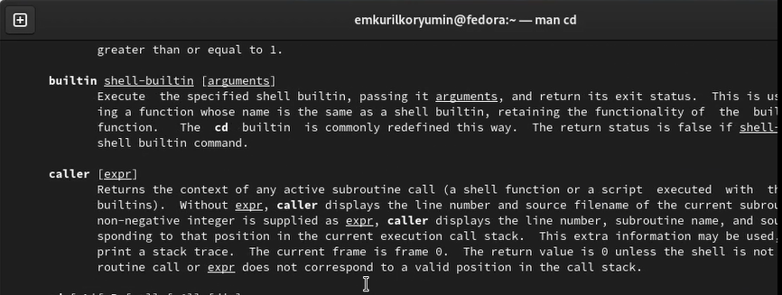{ #fig:010 width=70% height=70% }

## Справка по командам

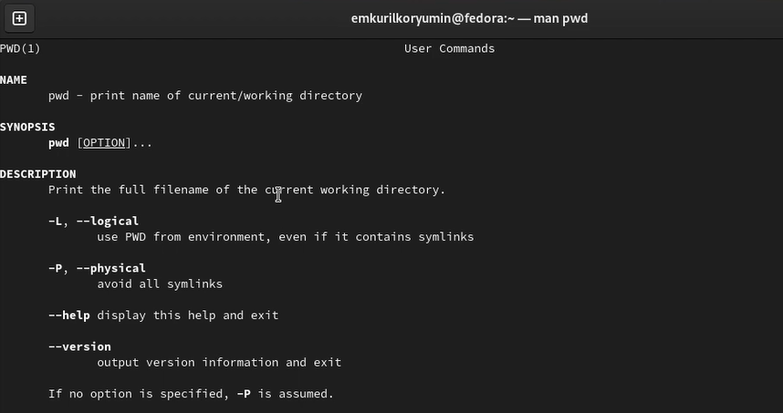{ #fig:011 width=70% height=70% }

## Справка по командам

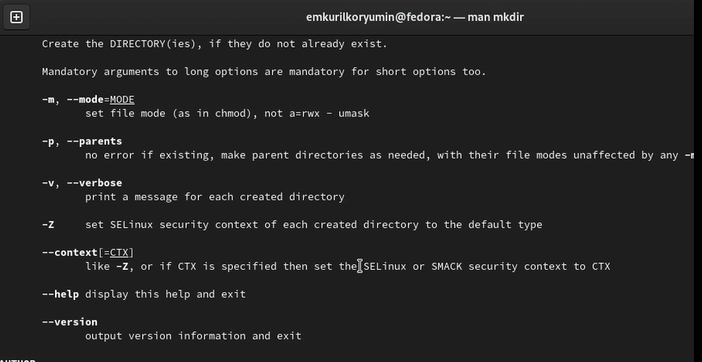{ #fig:012 width=70% height=70% }

## Справка по командам

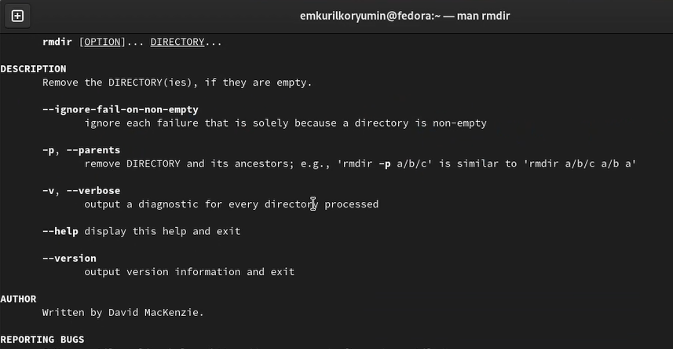{ #fig:013 width=70% height=70% }

## Справка по командам

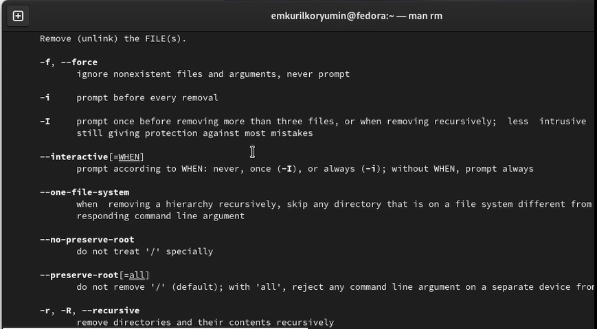{ #fig:014 width=70% height=70% }

## История командной строки

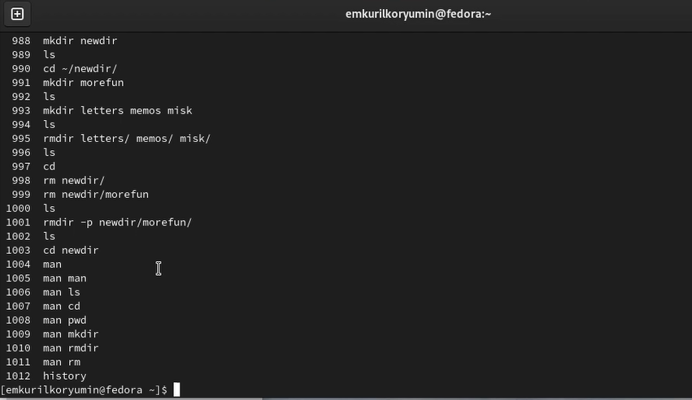{ #fig:015 width=70% height=70% }

# Выводы по проделанной работе

## Вывод

Я приобрел практические навыки взаимодействия пользователя с системой посредством командной строки.
