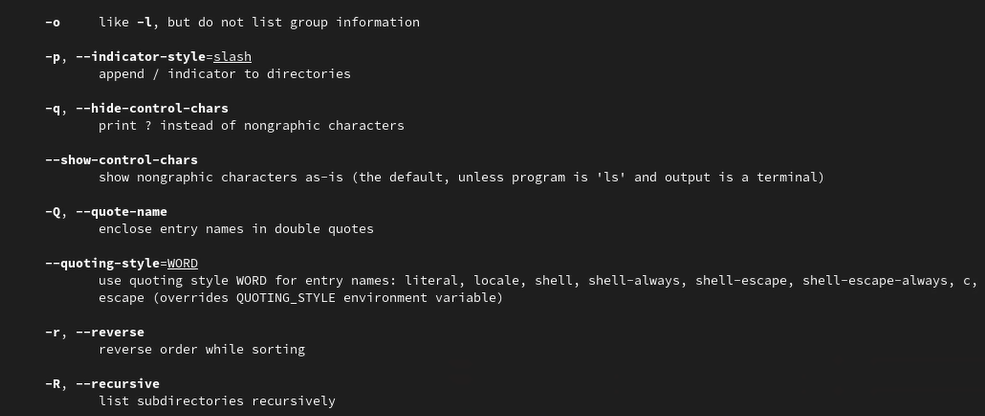
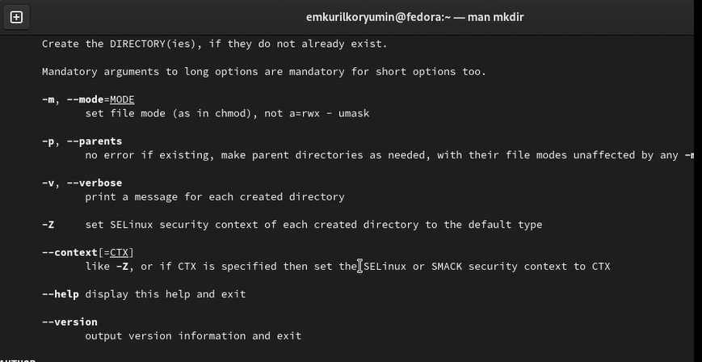

---
# Front matter
lang: ru-RU
title: "Отчёт по лабораторной работе №6"
subtitle: "Операционные системы"
author: "Курилко-Рюмин Е.М"

lang: ru-RU
bibliography: bib/cite.bib
csl: pandoc/csl/gost-r-7-0-5-2008-numeric.csl

# Formatting
toc-title: "Содержание"
toc: true # Table of contents
toc_depth: 2
lof: true # List of figures
fontsize: 12pt
linestretch: 1.5
papersize: a4paper
documentclass: scrreprt
polyglossia-lang: russian
polyglossia-otherlangs: english
mainfont: PT Serif
romanfont: PT Serif
sansfont: PT Sans
monofont: PT Mono
mainfontoptions: Ligatures=TeX
romanfontoptions: Ligatures=TeX
sansfontoptions: Ligatures=TeX,Scale=MatchLowercase
monofontoptions: Scale=MatchLowercase
babel-lang: russian
babel-otherlangs: english
biblatex: true
biblio-style: "gost-numeric"
biblatexoptions:
  - parentracker=true
  - backend=biber
  - hyperref=auto
  - language=auto
  - autolang=other*
  - citestyle=gost-numeric
figureTitle: "Рис."
tableTitle: "Таблица"
listingTitle: "Листинг"
lofTitle: "Список иллюстраций"
lotTitle: "Список таблиц"
lolTitle: "Листинги"
indent: true
pdf-engine: lualatex
header-includes:
  - \linepenalty=10 # the penalty added to the badness of each line within a paragraph (no associated penalty node) Increasing the value makes tex try to have fewer lines in the paragraph.
  - \interlinepenalty=0 # value of the penalty (node) added after each line of a paragraph.
  - \hyphenpenalty=50 # the penalty for line breaking at an automatically inserted hyphen
  - \exhyphenpenalty=50 # the penalty for line breaking at an explicit hyphen
  - \binoppenalty=700 # the penalty for breaking a line at a binary operator
  - \relpenalty=500 # the penalty for breaking a line at a relation
  - \clubpenalty=150 # extra penalty for breaking after first line of a paragraph
  - \widowpenalty=150 # extra penalty for breaking before last line of a paragraph
  - \displaywidowpenalty=50 # extra penalty for breaking before last line before a display math
  - \brokenpenalty=100 # extra penalty for page breaking after a hyphenated line
  - \predisplaypenalty=10000 # penalty for breaking before a display
  - \postdisplaypenalty=0 # penalty for breaking after a display
  - \floatingpenalty = 20000 # penalty for splitting an insertion (can only be split footnote in standard LaTeX)
  - \raggedbottom # or \flushbottom
  - \usepackage{indentfirst}
  - \usepackage{float} # keep figures where there are in the text
  - \floatplacement{figure}{H} # keep figures where there are in the text
---

# Цель работы

Приобретение практических навыков взаимодействия пользователя с системой посредством командной строки.

# Теоретические сведения

В операционной системе типа Linux взаимодействие пользователя с системой обычно
осуществляется с помощью командной строки посредством построчного ввода команд. 
При этом обычно используется командные интерпретаторы языка shell: ```/bin/sh; /bin/csh; /bin/ksh.```
Командой в операционной системе называется записанный по специальным правилам текст (возможно с аргументами), 
представляющий собой указание на выполнение какой-либо функций (или действий) в операционной системе.
Обычно первым словом идёт имя команды, остальной текст — аргументы или опции,конкретизирующие действие. Общий формат команд можно представить следующим образом:
```<имя_команды><разделитель><аргументы>```

* Команда man используется для просмотра (оперативная помощь) в диалоговом режиме руководства (manual) по основным командам операционной системы типа Linux.

* Команда cd. Команда cd используется для перемещения по файловой системе операционной системы типа Linux.

* Команда pwd. Для определения абсолютного пути к текущему каталогу используется команда pwd (print working directory).

* Команда ls. Команда ls используется для просмотра содержимого каталога.

* Команда mkdir. Команда mkdir используется для создания каталогов.

* Команда rm. Команда rm используется для удаления файлов и/или каталогов.

# Выполнение лабораторной работы

1. Определим полное имя нашего домашнего каталога. При помощи команды  cd перейдем в домашний каталог и увидим что его название совпадает с именем пользователя. Путь к нашему домашнему каталогу покажет команда pwd.

{ #fig:001 width=70% }

2.1. Перейдем в каталог /tmp, при помощи команды cd/tmp.

2.2. Выведем на экран содержимое каталога /tmp. Для этого используйте команду ls с различными опциями.

{ #fig:002 width=70% }

Мы можем увидеть подробное содержимое каталога, применив опцию -l
Применив опцию -f можем увидеть файлы списком

{ #fig:003 width=70% }

2.3. Определили, есть ли в каталоге /var/spool подкаталог с именем cron. Нету.

{ #fig:004 width=70% }

2.4. Перешли в домашний каталог и вывели на экран его содержимое. Определили, кто является владельцами файлов и подкаталогов посредством команды ls -al. Большинство файлов принадлежат моему полбзователю и root.    

{ #fig:005 width=70% }

3.1. В домашнем каталоге создали новый каталог с именем newdir при помощи команды mkdir.

{ #fig:006 width=70% }

3.2. В каталоге ~/newdir создали новый каталог с именем morefun.

3.3. В домашнем каталоге создали три новых каталога с именами letters, memos, misk, и затем удалили эти каталоги одной командой по конструкции    rm -r [имена файлов]. 

3.4. В задании к лабораторной предполагается, что каталог /newdir не получится удалить командой rm. Для этого сначала надо очистить каталог /newdir от подкаталога morefun. Но если использовать ключ -r к команде rm то тогда все удалится, не обращая внимания на подкаталоги.

{ #fig:007 width=70% }

4. С помощью команды man определим, какую опцию команды ls нужно использовать для просмотра содержимое не только указанного каталога, но и подката- логов, входящих в него. Введя в консоли man ls Мы получим справку на английском языке и в ней нужный нам ключ к команде. Это ключ -R

{ #fig:008 width=70% }

5. Также с помощью команды man определим набор опций команды ls, позволяющий отсортировать по времени последнего изменения выводимый список содержимого каталога с развёрнутым описанием файлов. Введя в консоли man ls  Мы получим справку на английском языке и в ней нужный нам ключ к команде. Это ключ -t.

6. Используем команду man для просмотра описания разных команд

{ #fig:010 width=70% }

{ #fig:011 width=70% }

{ #fig:012 width=70% }

{ #fig:013 width=70% }

{ #fig:014 width=70% }

7. Используя информацию, полученную при помощи команды history, выполним модификацию и исполнение нескольких команд из буфера команд.

{ #fig:015 width=70% }

# Вывод

Я приобрел практические навыки взаимодействия пользователя с системой посредством командной строки.

# Контрольные вопросы

1.	Что такое командная строка?
Ответ: текстовый интерфейс взаимодействия пользователя с системой

2.	При помощи какой команды можно определить абсолютный путь текущего каталога? Приведите пример.
Ответ: команда pwd, пример:
-	cd /var/www
-	pwd
-	/var/www/

3.	При помощи какой команды и каких опций можно определить только тип файлов и их имена в текущем каталоге? Приведите примеры.
Ответ: команда ls с опцией -F.

4.	Какие файлы считаются скрытыми? Как получить информацию о скрытых файлах? Приведите примеры.
Ответ: Некоторые файлы в операционной системе скрыты от просмотра и обычно используются для настройки рабочей среды. Имена таких файлов начинаются с точки. информацию о них можно получить с помощью команды ls с опцией -a.

5.	При помощи каких команд можно удалить файл и каталог? Можно ли это сделать одной и той же командой?
Ответ: С помощью команды rm можно удалить как отдельный файл так и целый каталог, в случае каталога необходимо указать опцию -r.

6.	Как определить, какие команды выполнил пользователь в сеансе работы? Ответ: с помощью команды history.

7.	Каким образом можно исправить и запустить на выполнение команду, которую пользователь уже использовал в сеансе работы? Приведите примеры Ответ: узнать порядковый номер этой команды с помощью history
затем изменить её сл. образом:
!<номер_команды>:s/<что_меняем>/<на_что_меняем>

8.	Можно ли в одной строке записать несколько команд? Если да, то как? Приведите примеры 

Ответ: да, можно, необходимо разделить команды символом точки с запятой в таком случае они будут выполняться последовательно в том порядке, в котором они записаны пример: cd /tmp/; ls -l;pwd

9.	Что такое символ экранирования? Приведите примеры использования этого символа.
Ответ: символ экранирования \ (обратный слэш) - символ, экранирующие управляющие конструкции и символы в названии файлов и папок Пример: ls /etc/nginx

10.	Какая информация выводится на экран о файлах и каталогах, если используется опция l в команде ls?
Ответ: тип файла, право доступа, число ссылок, владелец, размер, дата последней ревизии, имя файла или каталога.

11.	Что такое относительный путь к файлу? Приведите примеры использования относительного и абсолютного пути при выполнении какой-либо команды. 
Ответ: относительный путь - путь к тому или иному файлу или директории относительной текущей рабочей директории, пример:
папка /www/ в директории /var/ абсолютный путь: /var/www/
относительный путь(если рабочая директория - /var/): /www/

12.	Как получить информацию об интересующей вас команде?
Ответ: можно попробовать найти информацию по использованию с помощью утилиты man, или попробовать ввести опцию --help.

13.	Какая клавиша или комбинация клавиш служит для автоматического дополнения вводимых команд?
Ответ: клавиша Tab.


