---
## Front matter
lang: ru-RU
title: Презентация по лабораторной работе №7
subtitle: Операционные системы
author:
  - Курилко-Рюмин Е.М 
institute:
  - Российский университет дружбы народов, Москва, Россия
date: 23 марта 2024

## i18n babel
babel-lang: russian
babel-otherlangs: english

## Formatting pdf
toc: false
toc-title: Содержание
slide_level: 2
aspectratio: 169
section-titles: true
theme: metropolis
header-includes:
 - \metroset{progressbar=frametitle,sectionpage=progressbar,numbering=fraction}
 - '\makeatletter'
 - '\beamer@ignorenonframefalse'
 - '\makeatother'
 
## font
mainfont: PT Serif
romanfont: PT Serif
sansfont: PT Sans
monofont: PT Mono
mainfontoptions: Ligatures=TeX
romanfontoptions: Ligatures=TeX
sansfontoptions: Ligatures=TeX,Scale=MatchLowercase
monofontoptions: Scale=MatchLowercase,Scale=0.9

---

## Цель работы

 Целью данной лабораторной работы является ознакомление с файловой системой Linux, её структурой, именами и содержанием каталогов и приобретение практических навыков по применению команд для работы с файлами и каталогами, по управлению процессами (и работами), по проверке использования диска и обслуживанию файловой системы.

## Задание

 1. Ознакомиться с необходимыми материалами
 2. Выполнить все примеры из лабораторной работы
 3. Выполнить команды по копированию, созданию и перемещению файлов и каталогов
 4. Определить опции команды chmod
 5. Изменить права доступа к файлам
 6. Прочитать документацию о командах mount, fsck, mkfs, kill

# Выполнение лабораторной работы

## Выполнение 

 Создаю файл, копирую их. Создаю директорию, работаю с файлами

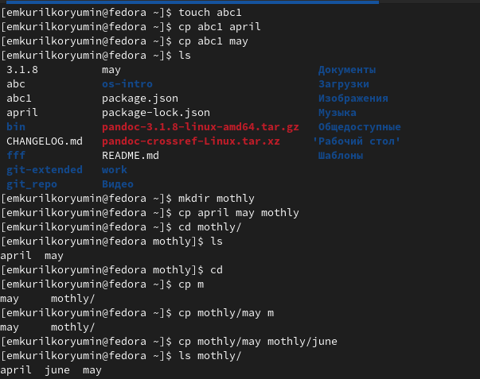

## Выполнение 

 Создаю директорию, выполняю рекурсивное копирование.
 
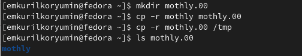

## Выполнение 

Переименовываю файл, затем перемещаю его в каталог. Работаю с директориями и их названиями.

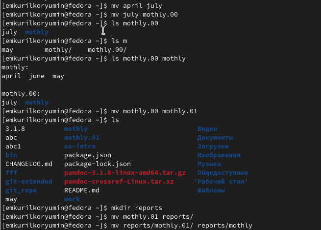

## Выполнение 

 Создаю пустой файл, проверяю права доступа у него, изменяю права доступа для файла и директории
 
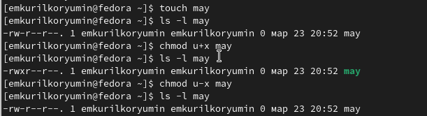

## Выполнение 

 Создаю новый пустой файл, даю ему права доступа. Проверяю файловую систему.

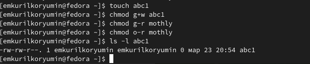

## Выполнить команды по копированию, созданию и перемещению файлов и каталогов

 Копирую файл в домашний каталог с новым именем, создаю новую пустую директорию, перемещаю файл в эту директорию, переименовываю файл.

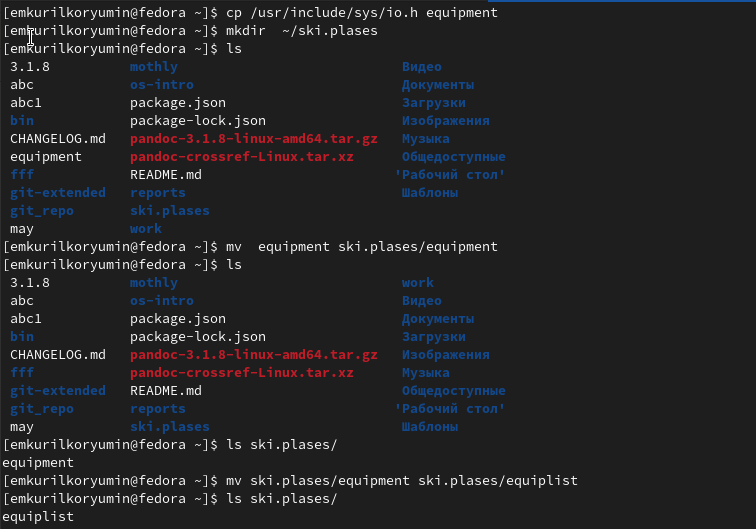

## Выполнить команды по копированию, созданию и перемещению файлов и каталогов

 Создаю новый файл, копирую его в новую директорию, но уже сразу с новым именем. Создаю внутри этого каталога подкаталог, перемещаю файлы в подкаталог.

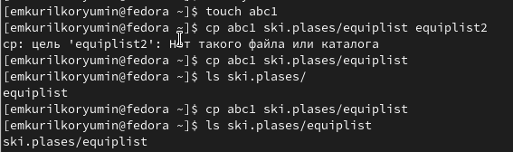

## Определить опции команды chmod

 Проверяю, какие права нужно поменять и как, чтобу у новой директория были нужные по заданию права.

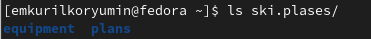

## Определить опции команды chmod

 Проверяю, какие права нужно поменять и как, чтобу у новых файлов были нужные по заданию права.

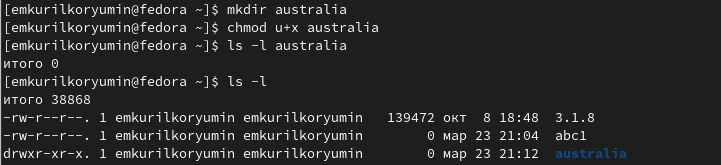

## Определить опции команды chmod

 Создаю файл, меняю права, затем создаю следующий файл, ему в правах доступа добавляю право на запись для группы. Читаю содержимое файла.

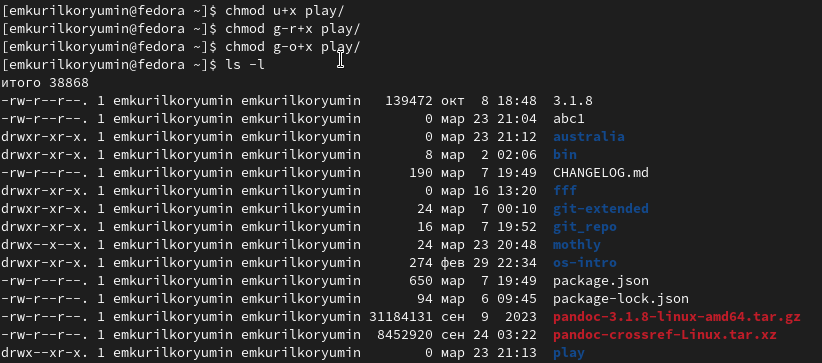

## Выполнить команды по копированию, созданию и перемещению файлов и каталогов

 Копирую файл с новым именем, перемещаю его в ранее созданную директорию, рекурсивно ее копирую с новым именем, рекурсивно копирую в нее скопированную до этого папку.

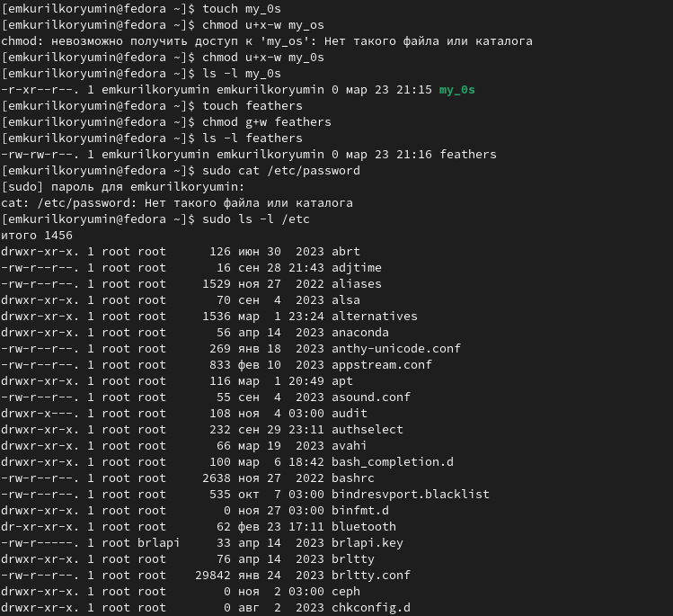

## Изменить права доступа к файлам

 Меняю права доступа файла и директори

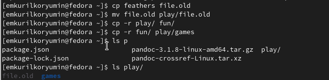

## Прочитать документацию о командах mount, fsck, mkfs, kill

- mount — утилита командной строки в UNIX-подобных операционных системах. Применяется для монтирования файловых систем.
- fsck (проверка файловой системы) - это утилита командной строки, которая позволяет выполнять проверки согласованности и интерактивное исправление в одной или нескольких файловых системах Linux. Он использует программы, специфичные для типа файловой системы, которую он проверяет.

## Прочитать документацию о командах mount, fsck, mkfs, kill

- mkfs используется для создания файловой системы Linux на некотором устройстве, обычно в разделе жёсткого диска. В качестве аргумента filesys для файловой системы может выступать или название устройства
- Команда Kill посылает указанный сигнал указанному процессу. Если не указано ни одного сигнала, посылается сигнал SIGTERM. Сигнал SIGTERM завершает лишь те процессы, которые не обрабатывают его приход. Для других процессов может быть необходимым послать сигнал SIGKILL, поскольку этот сигнал перехватить невозможно.

## Выводы

 Я ознакомился с файловой системой Linux, её структурой, именами и содержанием каталогов, приобрел практические навыки по применению команд для работы с файлами и каталогами, по управлению процессами (и работами), по проверке использования диска и обслуживанию файловой системы.
