---
## Front matter
title: "Отчет по этапу индивидуального проекта №1"
subtitle: "Операционные системы"
author: "Курилко-Рюмин Евгений Михайлович"

## Generic otions
lang: ru-RU
toc-title: "Содержание"

## Bibliography
bibliography: bib/cite.bib
csl: pandoc/csl/gost-r-7-0-5-2008-numeric.csl

## Pdf output format
toc: true # Table of contents
toc-depth: 2
lof: true # List of figures
lot: true # List of tables
fontsize: 12pt
linestretch: 1.5
papersize: a4
documentclass: scrreprt
## I18n polyglossia
polyglossia-lang:
  name: russian
  options:
	- spelling=modern
	- babelshorthands=true
polyglossia-otherlangs:
  name: english
## I18n babel
babel-lang: russian
babel-otherlangs: english
## Fonts
mainfont: PT Serif
romanfont: PT Serif
sansfont: PT Sans
monofont: PT Mono
mainfontoptions: Ligatures=TeX
romanfontoptions: Ligatures=TeX
sansfontoptions: Ligatures=TeX,Scale=MatchLowercase
monofontoptions: Scale=MatchLowercase,Scale=0.9
## Biblatex
biblatex: true
biblio-style: "gost-numeric"
biblatexoptions:
  - parentracker=true
  - backend=biber
  - hyperref=auto
  - language=auto
  - autolang=other*
  - citestyle=gost-numeric
## Pandoc-crossref LaTeX customization
figureTitle: "Рис."
tableTitle: "Таблица"
listingTitle: "Листинг"
lofTitle: "Список иллюстраций"
lotTitle: "Список таблиц"
lolTitle: "Листинги"
## Misc options
indent: true
header-includes:
  - \usepackage{indentfirst}
  - \usepackage{float} # keep figures where there are in the text
  - \floatplacement{figure}{H} # keep figures where there are in the text
---

# Цель работы

Научится размещать сайт на Github pages.Выполнить первый этап реализации индивидуального проекта.

# Задание

1. Установка необходимого ПО
2. Скачать шаблон темы сайта 
3. Разместить результат на хостинге Git
4. Установить параметр для URL's сайта 
5. Разместить заготовку сайта на хостинге Github pages

# Выполнение лабораторной работы

##Установка необходимого ПО

Скачиваю последнюю версию hugo для моей операционной системы (рис.1).

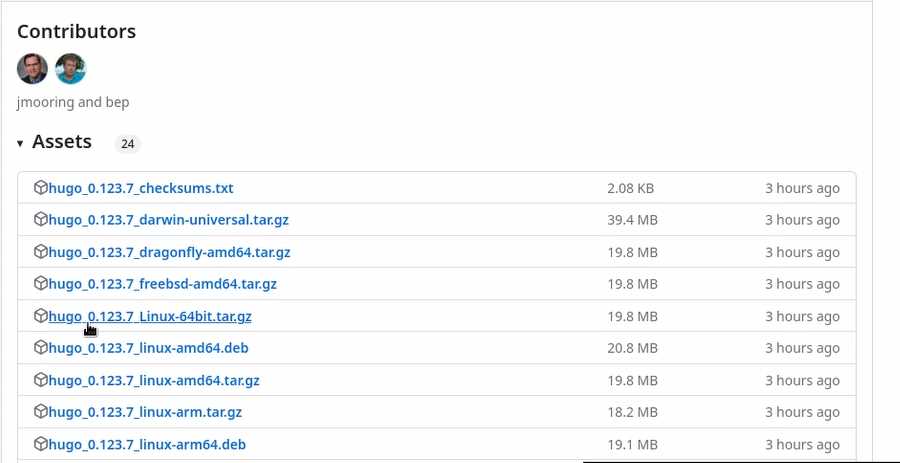{#fig:001 width=70%}

Распаковываю архив с исполняемым файлом (рис.2).

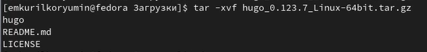{#fig:002 width=70%}

Создаю пустую папку bin с помощью утилиты mkdir ,переношу в созданную папку файл hugo (рис.3).

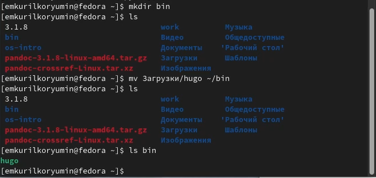{#fig:003 width=70%}

## Скачивание шаблона темы сайта

Открываю репозиторий с шаблоном темы сайта (рис.4).

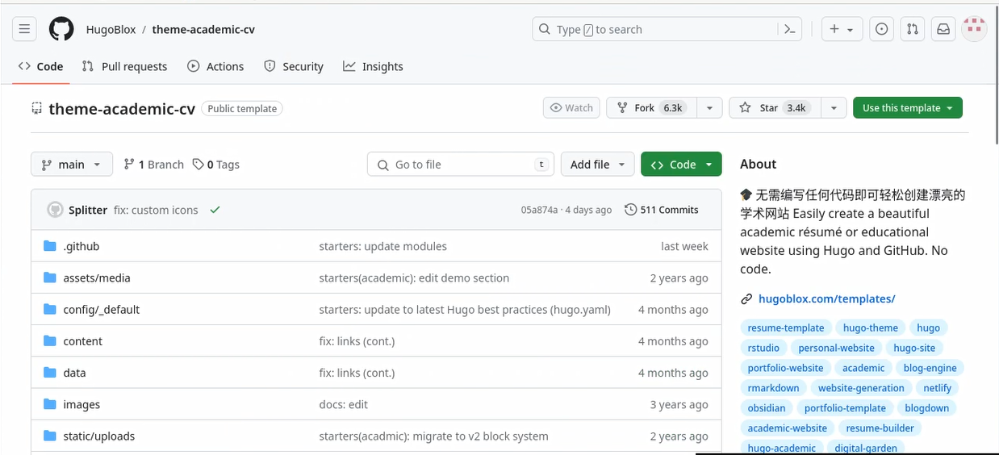{#fig:004 width=70%}

Создаю свой репозиторий blog на основе репозитория с шаблоном темы сайта (рис.5).

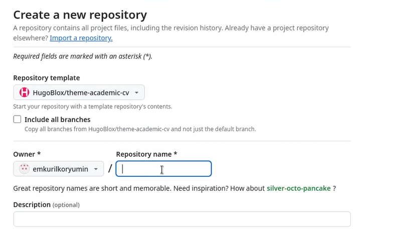{#fig:005 width=70%}

Клонирую созданный репозиторий к себе в локальный репозиторий (рис.6).

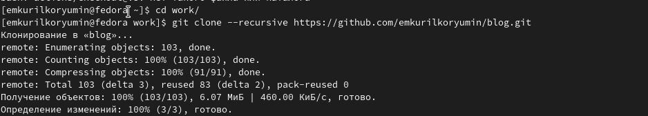{#fig:006 width=70%}

##Размещение результатов на хостинге Git

Запускаю исполняемый файл (рис.7).

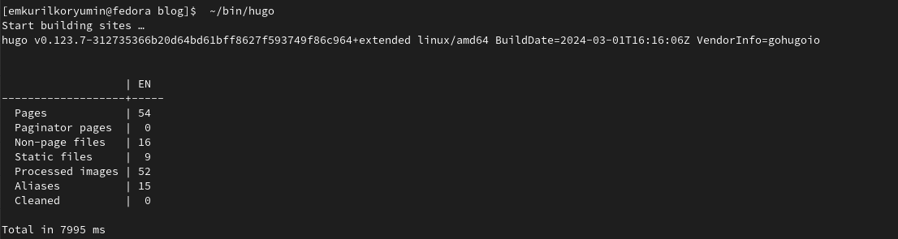{#fig:007 width=70%}

Удаляем папку public которая нам не нужна на данном этапе (рис.8).

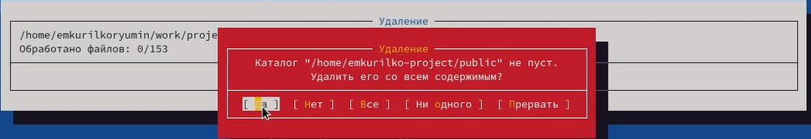{#fig:008 width=70%}

Запускаю исполняемый файл hugo с командой server (рис.9).

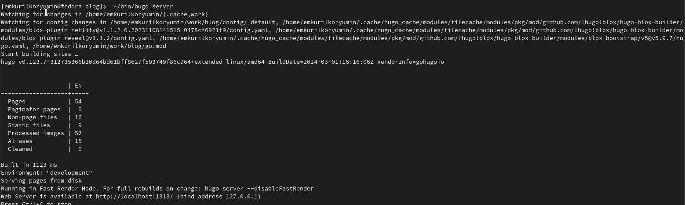{#fig:009 width=70%}

Открываю сгенерированую страницу сайта на локальном сервере (рис.10).

{#fig:010 width=70%}

##Установка параметров для URL's сайта 

Теперь создаю новый пустой репозиторий чье имя будет адресом сайта (рис.11).

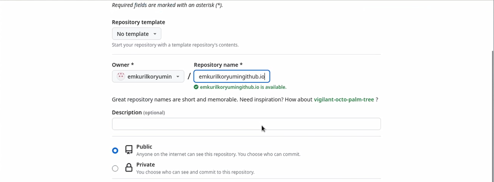{#fig:011 width=70%}

Клонирую созданный репозиторий, чтобы создать локальный репозиторий у себя на компьютере (рис.12).

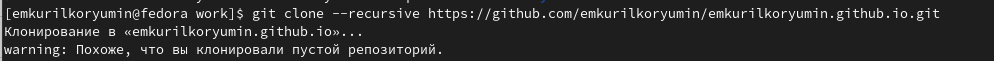{#fig:012 width=70%}

Создаю главную ветку с именем main (рис. @fig:013).

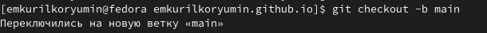{#fig:013 width=70%}

Создаю пустой файл README.md и отправляю изменения на глобальный репозиторий, чтобы его активировать (рис.14).

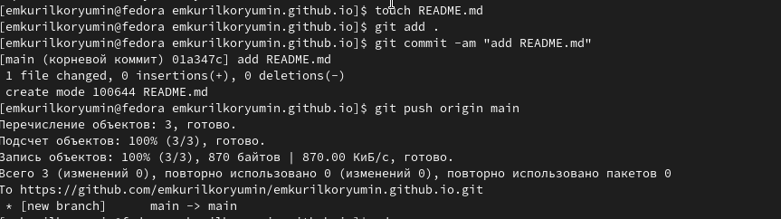{#fig:014 width=70%}

Перед тем как подключать созданный пустой репозиторий к каталогу public из репозитория blog, нужно отключить в файле gitignore public, чтобы каталоги с таким названием не игнорировались (рис.15).

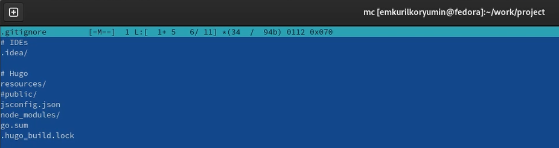{#fig:015 width=70%}

Подключаю репозиторий к каталогу public (рис.16).

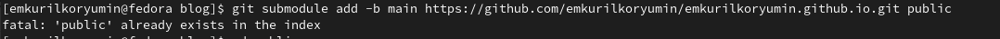{#fig:016 width=70%}

Снова выполняю команду исполняемого файла, чтобы заполнить создавшийся каталог public (рис.17).

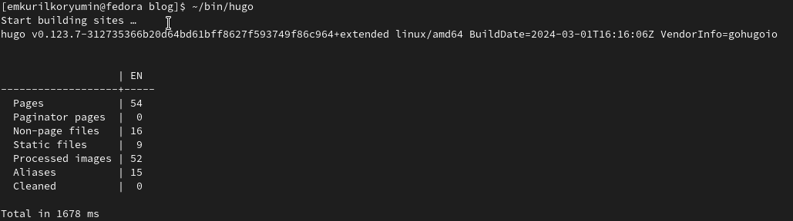{#fig:017 width=70%}

##Размещение заготовки сайта на хостинге Github pages

Проверяю подключение public к моему репозиторию emkurilkoryumin.github.io, затем отправляю изменения на глобальный репозиторий (рис.18).

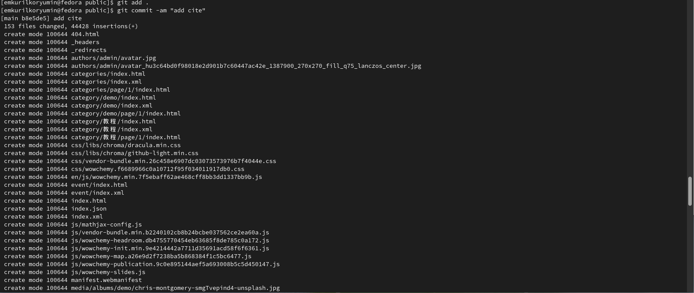{#fig:018 width=70%}

# Выводы

Я преобрел навыки размещения сайта на Github pages.Выполнил первый этап реализации индивидуального проекта 

