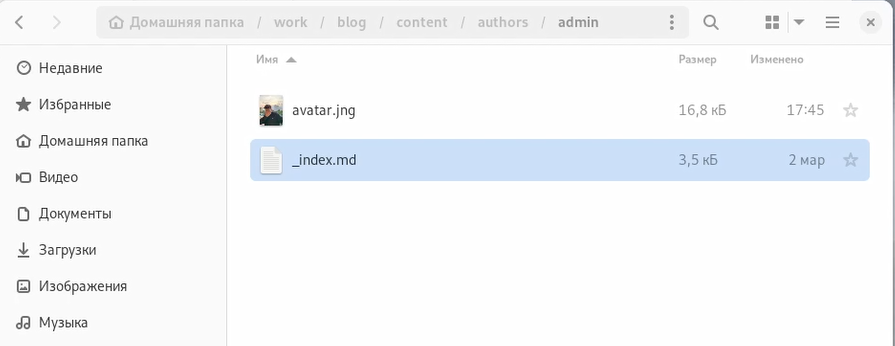
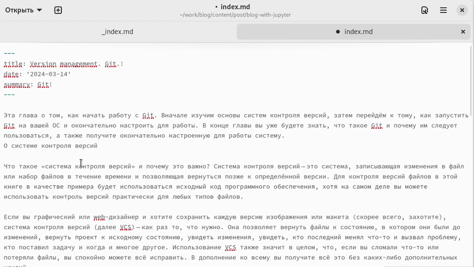
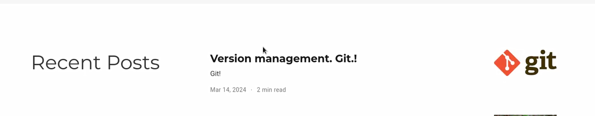
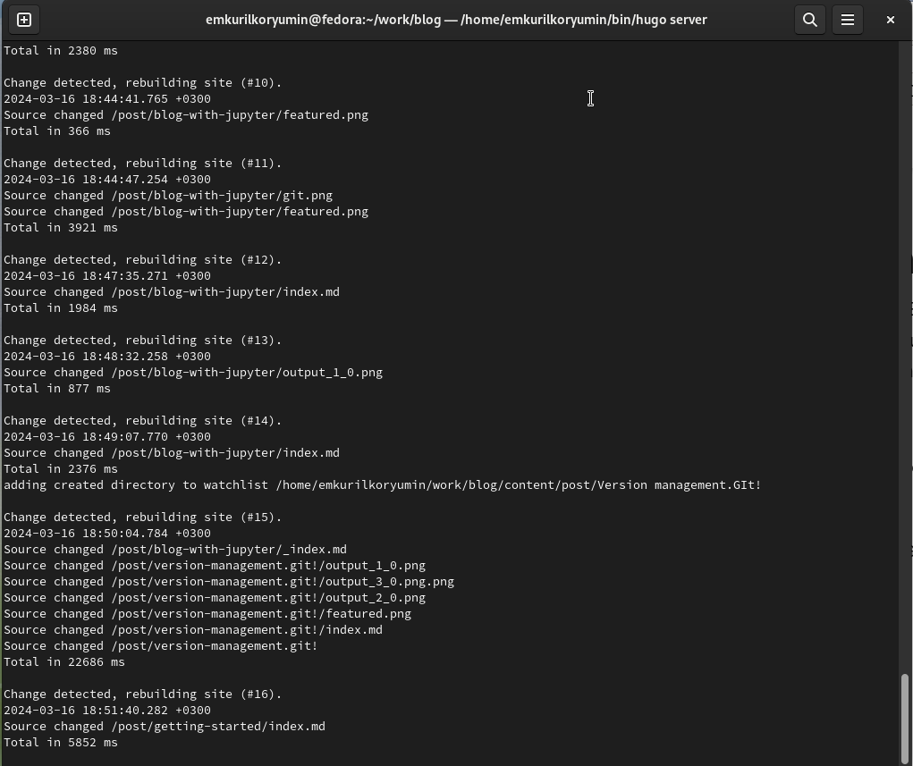
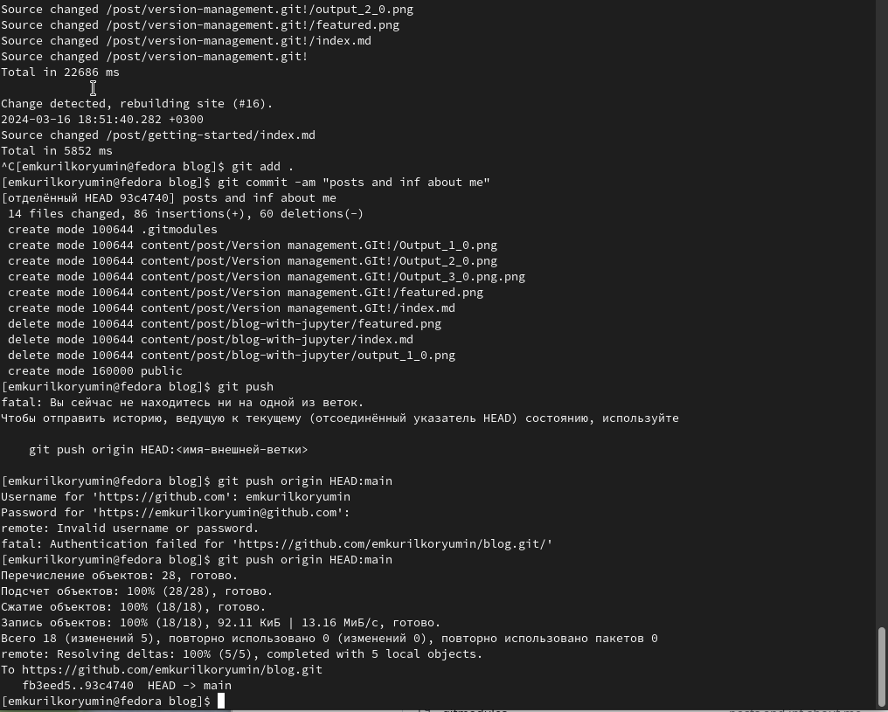

---
## Front matter
lang: ru-RU
title: Отчет по этапу персонального проекта № 2
subtitle: Операционные системы 
author:
  - Курилко-Рюмин Е.М
institute:
  - Российский университет дружбы народов, Москва, Россия

date: 14 марта 2024

## i18n babel
babel-lang: russian
babel-otherlangs: english

## Formatting pdf
toc: false
toc-title: Содержание
slide_level: 2
aspectratio: 169
section-titles: true
theme: metropolis
header-includes:
 - \metroset{progressbar=frametitle,sectionpage=progressbar,numbering=fraction}
 - '\makeatletter'
 - '\beamer@ignorenonframefalse'
 - '\makeatother'
 
## font
mainfont: PT Serif
romanfont: PT Serif
sansfont: PT Sans
monofont: PT Mono
mainfontoptions: Ligatures=TeX
romanfontoptions: Ligatures=TeX
sansfontoptions: Ligatures=TeX,Scale=MatchLowercase
monofontoptions: Scale=MatchLowercase,Scale=0.9
---

# Цель работы

 Продолжить выполнение работ со своим сайтом. Редактировать его в соответствии с требованиями. Добавить данные о себе, несколько постов.

# Задание

 1. Ознакомиться с необхонимой технической частью.
 2. Разместить фотографию владельца сайта.
 3. Разместить краткое описание владельца сайта (Biography).
 4. Добавить информацию об интересах (Interests).
 5. Добавить информацию от образовании (Education).
 6. Добавить пост на тему управление версиями. Git.

# Теоретическое введение

 Нugo — генератор статических страниц для интернета.

 Немного о статистических сайтах:

    1. Статические сайты состоят из уже готовых HTML-страниц.
    2. Эти страницы собираются заранее, а не готовятся для пользователя «на лету». Для этого используют генераторы статичных сайтов.
    3. Так как это почти чистый HTML, то такие сайты быстрее загружаются и их проще переносить с сервера на сервер.
    4. Минус: если нужно что-то обновить на странице, то сначала это правят в исходном файле, а потом запускают обновление в генераторе.
    5. Ещё минус: такие страницы не подходят для интернет-магазинов или сайтов с личным кабинетом, потому что в статике нельзя сформировать страницу для каждого отдельного пользователя.

# Выполнение лабораторной работы

 Добавляю свою фотографию в папку blog/content/authors/admin, удаляю фотографию шаблона (рис.1).

{#fig:001 width=70%}

## Выполнение лабораторной работы

 В файле index.md в той же папке изменяю необходимую информацию, редактируя под себя. Указываю свои интересы, образование, личные данные. (рис.2).

{#fig:002 width=70%}

## Выполнение лабораторной работы

 Проверяю, что на локальном сайте все есть. Локальный сайт запускается все также с помощью hugo server (рис.3).

{#fig:003 width=70%}

## Выполнение лабораторной работы

 Заполняю файл index.md в post2, это пост про управление версиями Git (рис.4).

{#fig:004 width=70%}

## Выполнение лабораторной работы

 Проверяю посты на локальном сервере (рис.5).

{#fig:005 width=70%}

## Выполнение лабораторной работы

 Закрываю локальный сервер. Генерирую сайт с изменениями (рис.6).

{#fig:006 width=70%}

## Выполнение лабораторной работы

 Отправляю данные в гитхаб  (рис.7).

{#fig:007 width=70%}

# Выводы

 В процессе выполнения второго этапа индивидуального проекта я приобрел практические навыки редактирования данных о себе, написания постов и добавлениях их на сайт.
